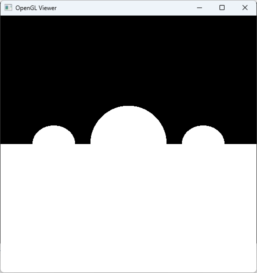
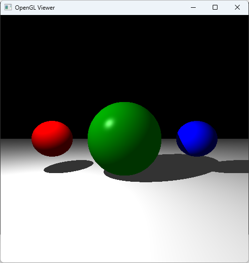
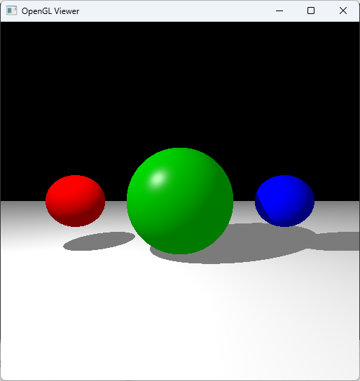
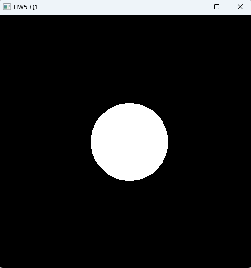

# Computer Graphics Homework - Ray Tracer

This repository contains my implementation of a simple ray tracer for the Computer Graphics course assignment.

---

## 📁 Project Structure

The Visual Studio project includes:

- ProjectFolders
  - `EmptyViewer`
  - `HW1`
  - `HW2_Q1`
  - `HW2_Q2`
  - `HW2_Q3`
  - `HW5_Q1`
- `.sln` (solution)
- `include/`
- `lib/`
- `results/`

---

## 🖼 Result Screenshots

| Assignment | Screenshot | Description |
|------------|------------|-------------|
| **HW1**    |      | Ray Intersection |
| **HW2_Q1** |   | Phong Shading |
| **HW2_Q2** |   | Gamma Correction |
| **HW2_Q3** |   | Antialiasing |
| **HW5_Q1** |   | Transformations and Rasterization ❗Used OpenGL for displaying the final rendered image on screen. |

> All screenshots are stored in the `results/` directory.

---

## 🛠 How to Compile & Run

### ✅ Requirements

- Visual Studio 2022 or later
- C++17 or above
- GLFW (included in project or install separately)
- OpenGL (automatically supported in VS)

### 💻 Build Instructions

1. Clone the repository or download as ZIP.
2. Open the `.sln` file with Visual Studio.
3. Make sure the configuration is set to `x64` and `Release` or `Debug`.
4. Select the .cpp file with the same name as the project you want to run, then press Ctrl + F5 to execute it.

> If you get missing GLFW errors, download and link GLFW library or use NuGet to install it inside Visual Studio.

---

### 🧩 External Libraries

- [GLFW](https://www.glfw.org/) – For window and OpenGL context handling
- [GLAD / GLEW] (optional) – If used for OpenGL function loading

---

## ✍️ Author

- **Name**: Lee HaEun
- **Student ID**: 202111355
- **Course**: Computer Graphics
